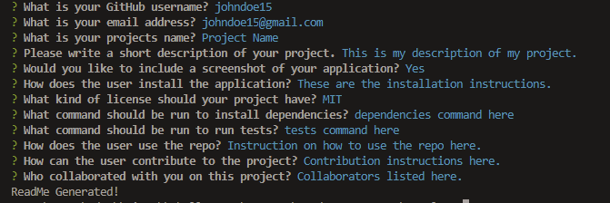

# README Generator
  
  ## Description
  The README Generator application dynamically creates a customized README file for any project given a set of user responses to prompts in the terminal. The purpose in creating this application is to save developers time in building their own README so that they can devote more time to building their application. 
  

  ## Table of Contents
  * [Installation](#installation)

  * [Usage](#usage)

  * [License](#license)

  * [Contributing](#contributing)

  * [Tests](#tests)

  * [Questions](#questions)

  * [Credits](#credits)

  

  ## Installation
  Clone the repository onto your local machine. Open the file in your preferred code editor. Open an integrated terminal for the index.js file. 
  
  To install dependencies, run the following command in the command line npm i.
  
  ## Usage
  Once you clone the repo and install the dependencies you will be given a series of prompts to answer. Simply respond to each question in the terminal.  Once you have answered all prompts, a message will appear saying, "ReadMe Generated". *If you choose to include a screenshot you will need to save it in the assets folder as the name: screenshot.png

  

  Usage Link: https://drive.google.com/file/d/121s8H2DHk4Gw5K2y1d9htt-QGJpDuEEN/view?usp=share_link 
  
  
  ## License
  Notice: This application is covered under the  license.

  Link: https://img.shields.io/static/v1?label=License&message=MIT&color=$blue

  ## Contributing
  At this time there are no plans to include contributions to this project. 

  ## Tests
  To run a test of the application, run the following command in the command line node index.
  
  ## Questions
  Please reach out to me below if you have any questions.

  
  GitHub: [adamhood15](https://github.com/adamhood15)

  Email: adamhood15@gmail.com
  
  ## Credits
  I am the sole collaborator on this project. Rice University provided the starter code. 